# FashionHouse Application

By Hasan Esat Kayman 

# Introduction

  I have created a Fashion House of BackEnd system, created using Java Spring Boot, PostMan and MySQL. My project will be futher developed and linked to front end to fully function for user interaction and the transfer of data from the the database of products and meet the  needs of the Fashion House. I have created varios Crud operations like (Create, Read, Update, Delete and read by a certain statment like Name or Id or Size) the operations will help us understand how the front end will comunicate with our database and how certian operations would work. i have created two tabels as a start which will be futher developed by adding customers and a size tabel when we take our business global. This READ ME file is a breife intorduction of my project and how my project is functioning so far.
  
# Features of my Fashion House Project
  
  * Creating new products and product categories 
  * Updating products and product categories
  * Deleting products and product categories
  * Viewing products by Id
  * Viewing products by Name 
  * Viewing products by Size
  * Viewing products by Colour
  * Viewing products catageory by Id
  * Viewing products catageory by Name

 # Tools Used:
  
  To create this project i have used the following tools to run my application.
 
  * The STS IDE made managing imports, debugging my code and refactoring substantially easier.
  * We used Maven to manage most of the dependancies of my application.
  * We used Junit to run our Tests.
  * We used MySQL workbench to create a local database.
  * We used Postman to test the back end funcuality of my application without using a front end.

# Planing of my Backend:

I planned out how i should have my tabels and how they should be joined and the data that should be stored in the tabels on excell before i started the project.

	        

 
  
  
  
 # Fashion House Structure:
  
  * I have created a folder structure that will sperate the document depnding on their uses so all repositorys will be in one package and all controllers     will be in a single package. 
  

	        

 

	        

 

	        

 
  
  
  
  
# Entity Relationships
  
  I have illustrated below an ERD diagram showing the relationship between the tabels.
  

	        

 

# Suceesfull Execution

my application runs sucessfully and with tabels created

	        

 

	        

 
  
# Product Category:
        
        
* Add Product Category

We could use crud operations to add a product category for new future markets like makeup line.

	        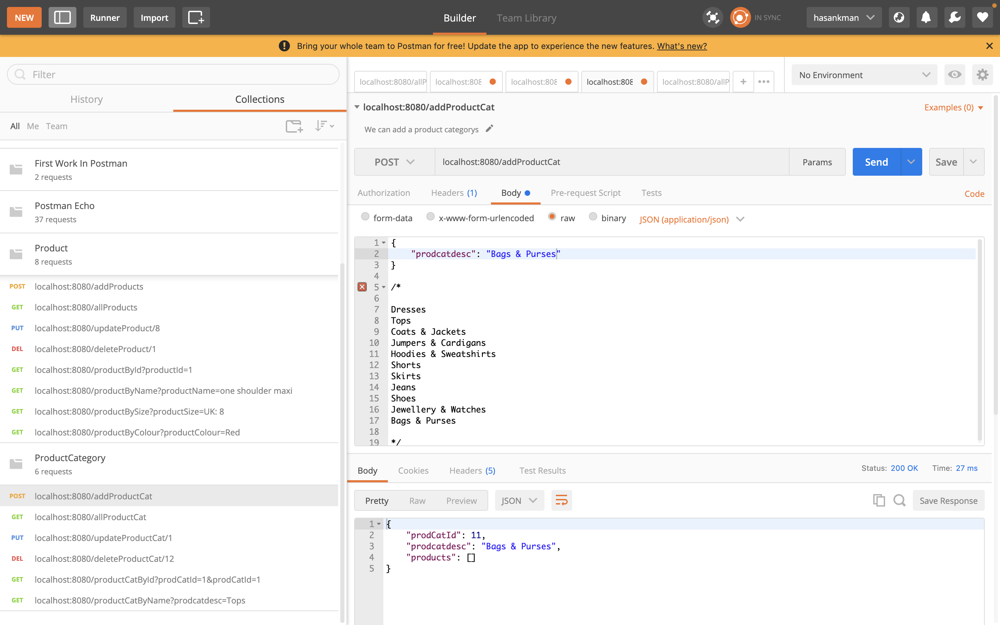

 

* View all Product Categorys

We could use crud to view all our product categorys with all the products which are in the form of a list and its details.
        

	        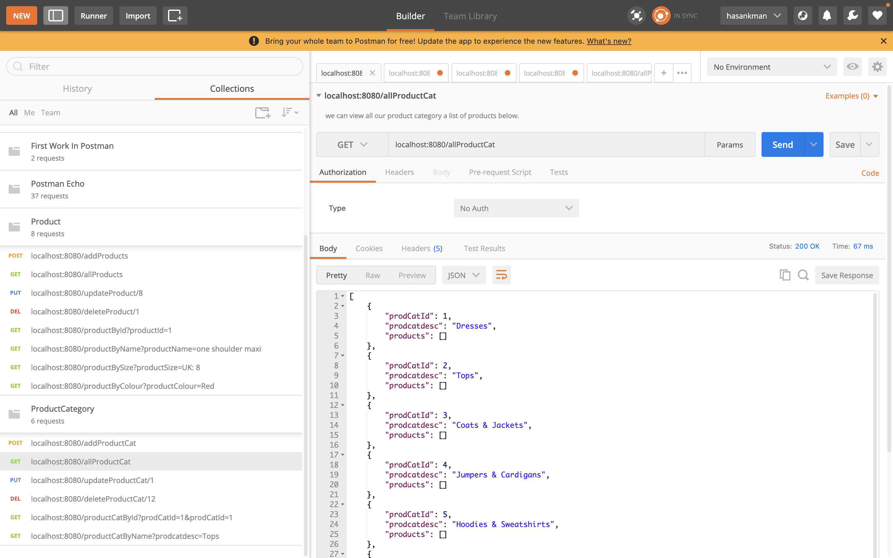

 
        
* Update Product Category

We could up date our product Categorys depending how we would like to develop our code for futre developments.
        

	        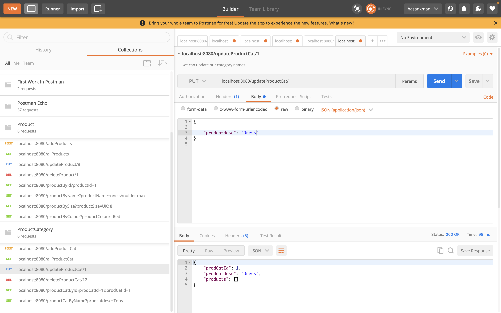

 
        
* Delete a Product Category 

We could delete a Product Category depending on what we changes we would like to make to our systems.
        

	        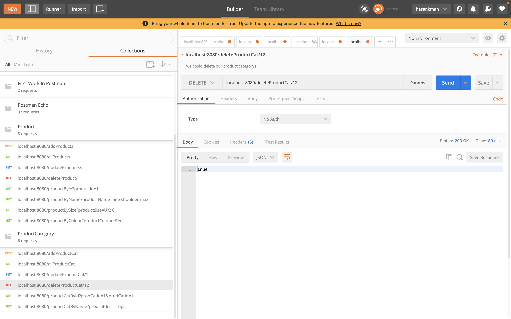

 
        
* View Product Category By Id

We could view our Product Categorys using Product Category Id's which will show us Product Categorys and products.
        

	        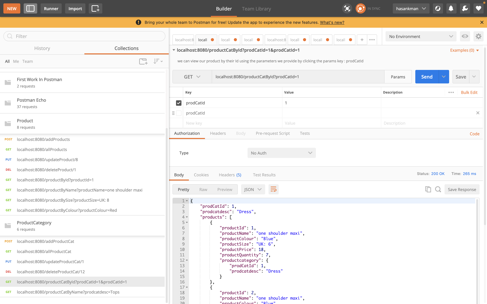

 
        
*View Product Category By Name
	
We could also view Product Categorys by the given names like Dress or Tops which could be easier to remember then Product Category Id it will out           put the same response as Product Category By Id.

	        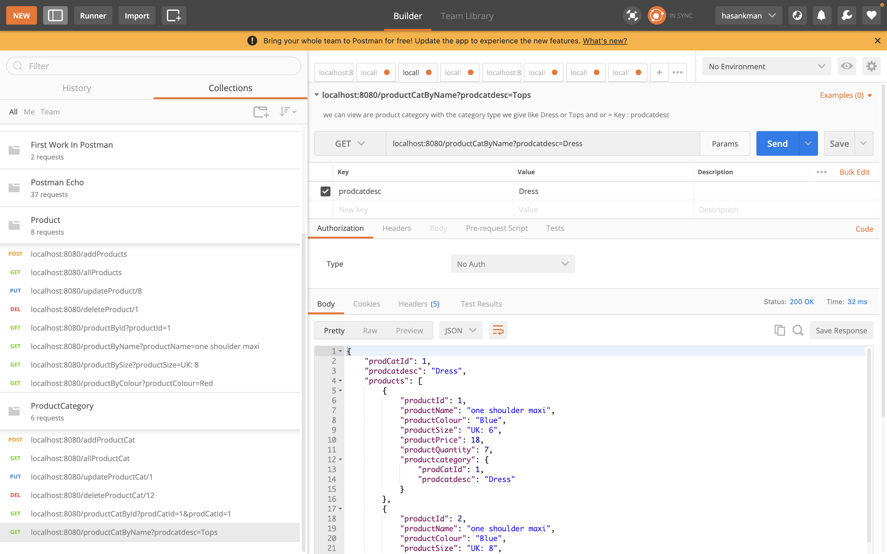

  
# Products:
  
        
* Add Product 

We could use crud operations to add a product for to our systems.

	        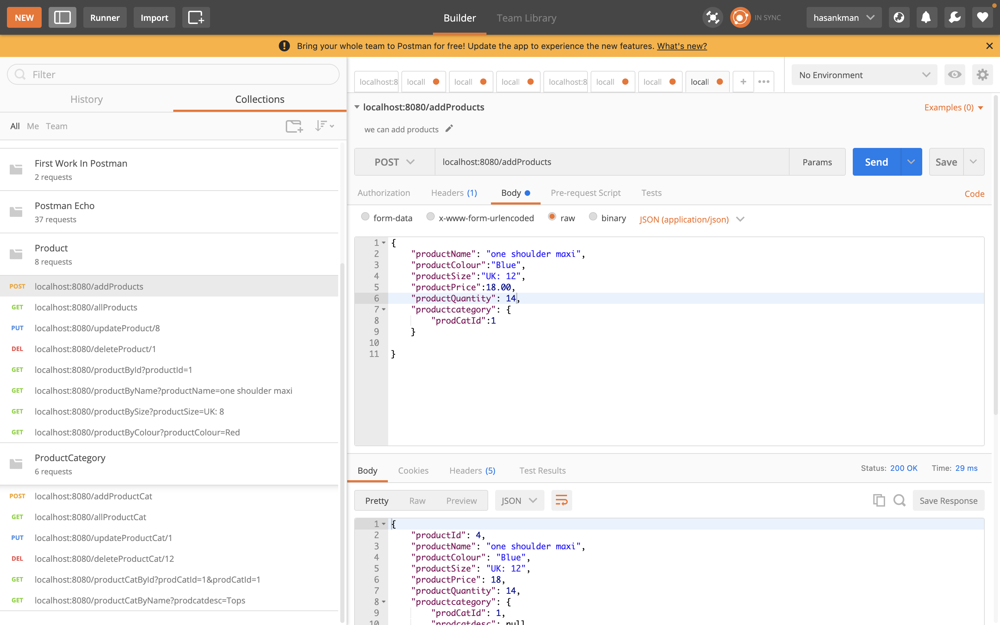

* View all Product 

We could use our product with all the List of product which are in the form of a list and its details.

	        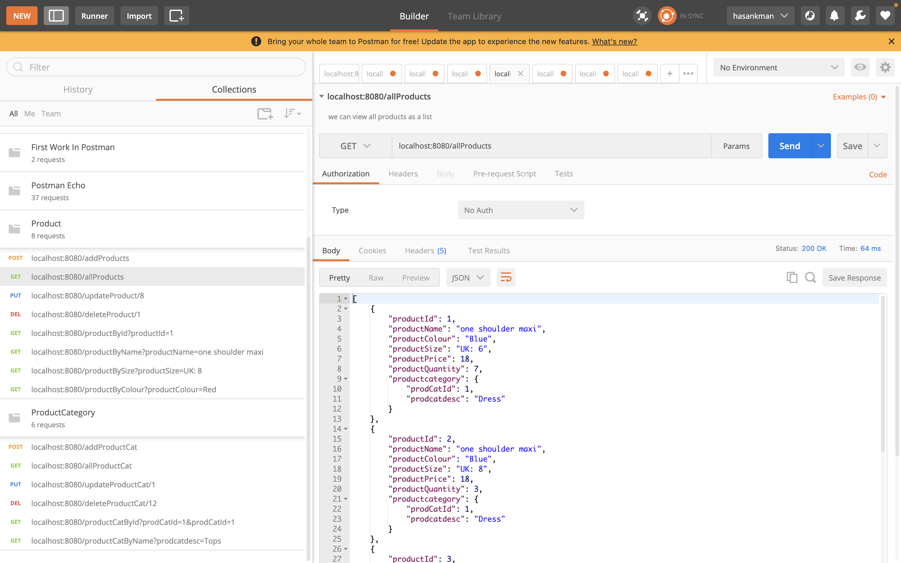

* Update Product 

We could update our Products depending on the changes we would like to make like quantity or price.

	        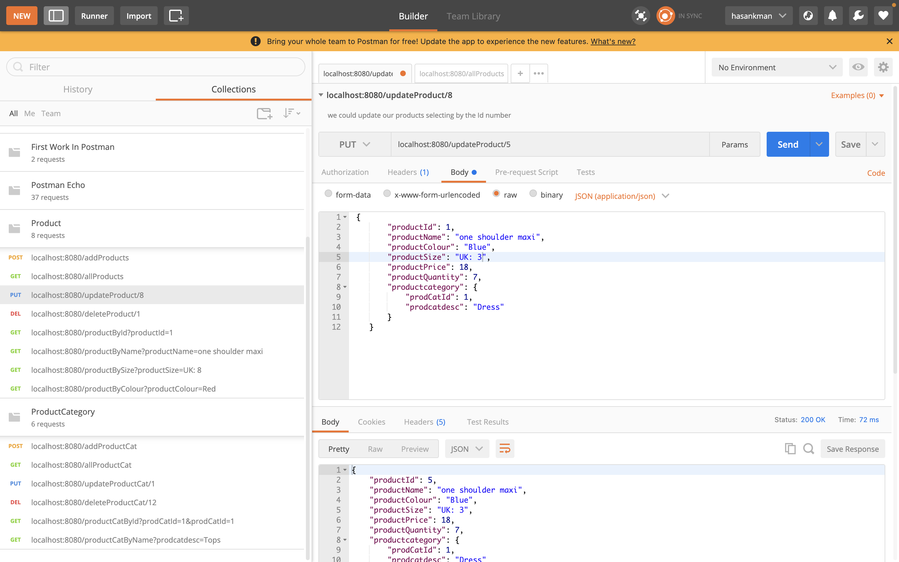

       
* Delete a Product  

We could also delete a Product if there is no need or if a mistake has been made.

	        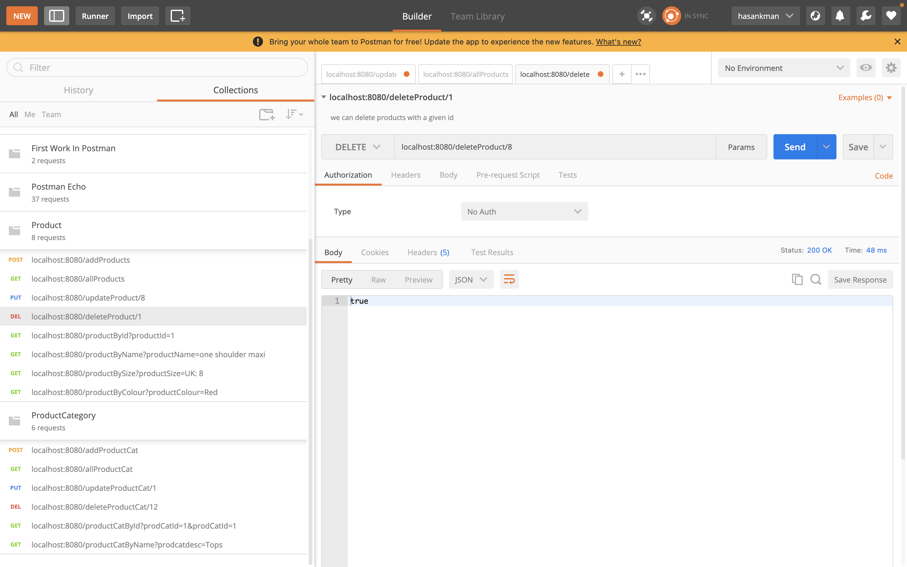

        
* View Product By Id

we could view a product by the Product Id 

	        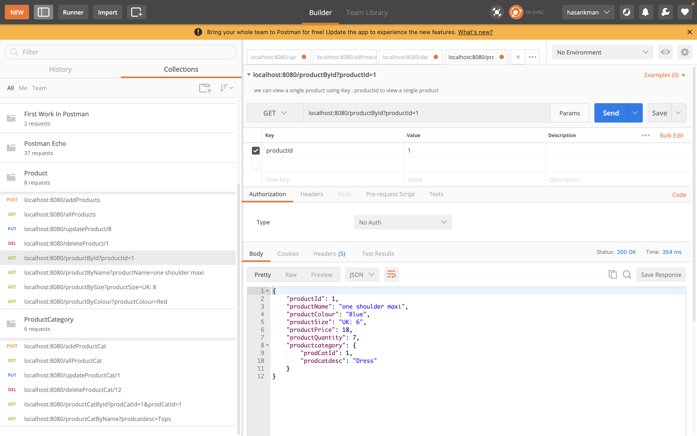

        
* View Product By Name

We could view Products by its name which gives us the advantage of viewing it in diffrent sizes that are available

	        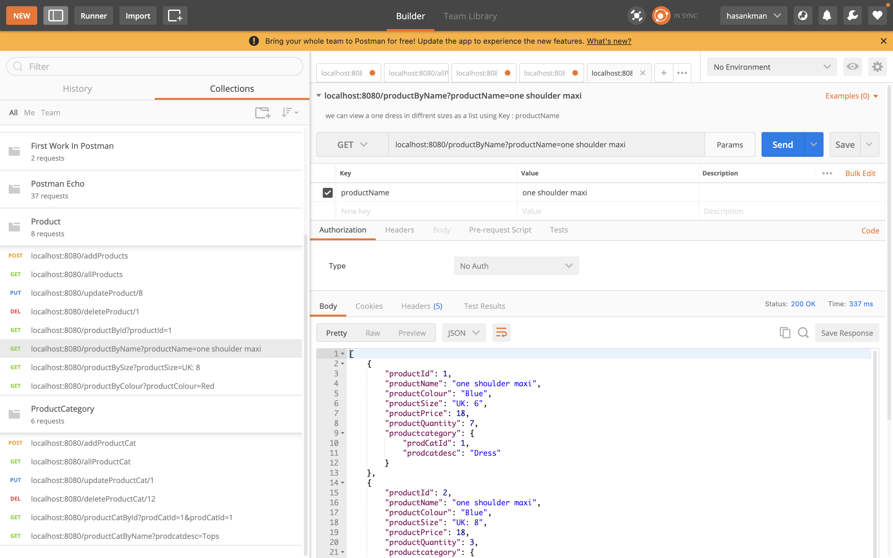

        
* View Product By Size

We could view a Products by the Size that are available which will show us the every product in the requested size.

	        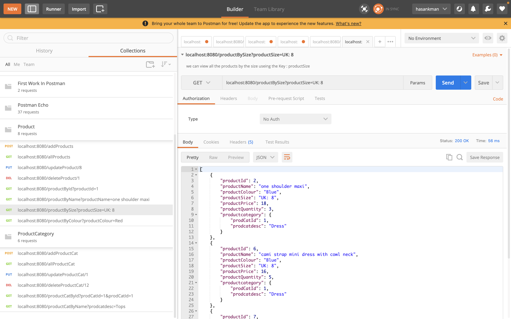

* View Product By Colour

We could view our products by its Colour which will display every product in that colour.
  

	        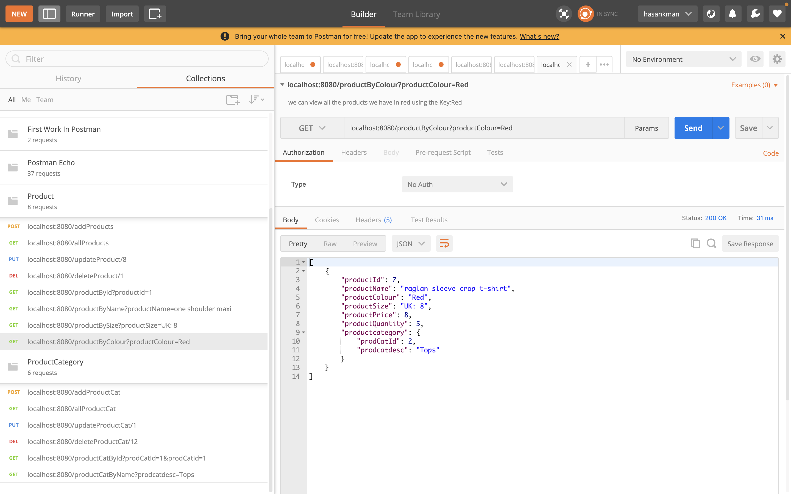

  
  
# Application Tests :
  
  I have test my applications and they have failed however i am going to develop it futher to make sure it is working and all tests pass i need to figure   out how the relation 
  
 

	        

  

	        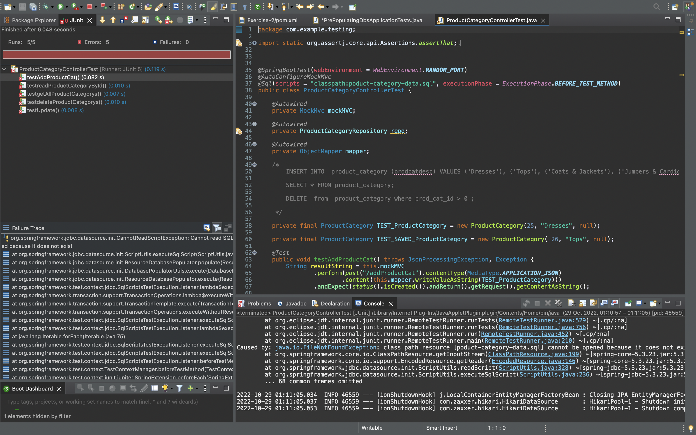

  

	        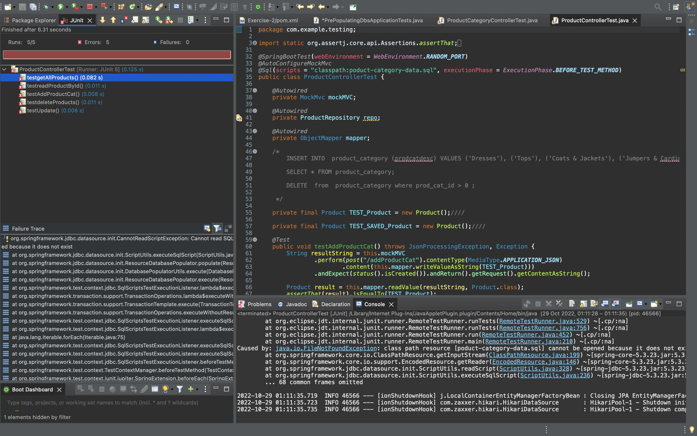

  
        
# Steps to run:

 * The Application runs on Java version 8.
 * The application runs on port 8080 the port must not be in use.
 * Local MySQL must exist on port 3306.
 * You must conect to the databace with username and password decleared.
 * In addition you must have a database called Fashion House.
 * The user must run FashinHouseAplication.Java as a spring boot application.
 * The user must also use postman to (CRUD Operations) interact with the aplication without a frontend.

# What I learned:

I learned how a backend of an application is developed and how we could use Postman to see how the application will function without a frontend and how we could make sure that the backend is functional and the code runes as we would want it to. Also i have learned how java comunicates with a database when an application is running how data is being fetched and presented for the use of a user when called. I will work on my tests to make sure they run successfully because they should not fail because my application works suceesfull and every CRUD Operation works succesfully. I have also learned how we could realate data to one to another and have relations between the tabels.
